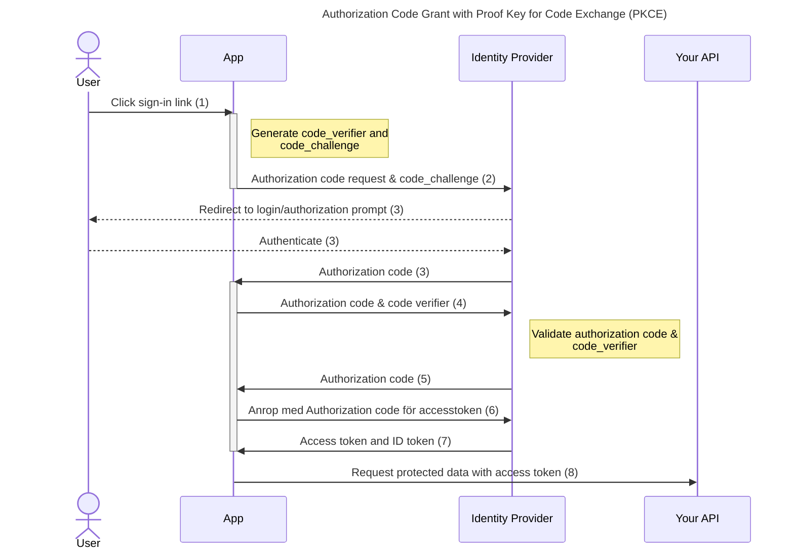

# Terraform configuration to manage Jitsi Meet server

Currently supports Amazon AWS. Read more [here](./aws/).

## Principle of function

```mermaid
---
title: Authorization Code Grant with Proof Key for Code Exchange (PKCE)
---
sequenceDiagram
  actor User
  User->>App: Click sign-in link (1)

  activate App
  Note right of App: Generate code_verifier and<br/>code_challenge
  App->>Identity Provider: Authorization code request & code_challenge (2)
  deactivate App

  Identity Provider-->>User: Redirect to login/authorization prompt (3)
  User-->>Identity Provider: Authenticate (3)
  Identity Provider->>App: Authorization code (3)

  activate App
  App->>Identity Provider: Authorization code & code verifier (4)
  Note right of Identity Provider: Validate authorization code &<br/>code_verifier

  Identity Provider->>App: Authorization code  (5)
  App->>Identity Provider: Anrop med Authorization code för accesstoken (6)

  Identity Provider->>App: Access token and ID token (7)
  deactivate App

  App->>Your API: Request protected data with access token (8)
```
